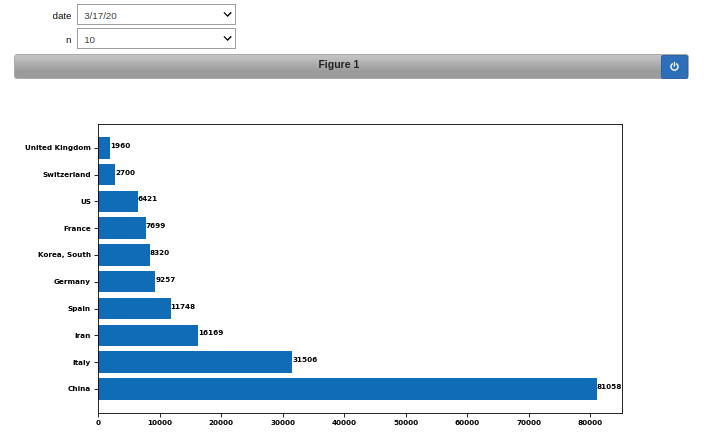
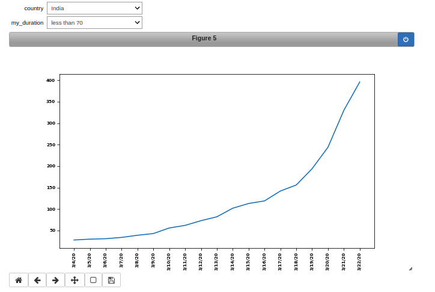
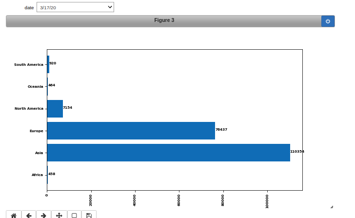

# Day 1

### Problem Statement

On a particular date, If 70% number of confirmed case is zero, then Delete the column. i.e. whole February will be deleted and few more.
Plot the graph

   - Country Wise
   - Date Wise
   - Continent Wise

### Requirements

`pip3 install ipywidgets`

`jupyter nbextension enable --py widgetsnbextension`

### Dataset

The dataset used in the problem can be found here:

[Covid 19 Dataset](input/time_series_2019-ncov-Confirmed.csv)

[Continents](continents.csv)

## Outputs

### Country-wise Plot

### Date-wise Plot

### Continent-Wise Plot

### Acknowledgement

1. Thank to TFUG Mumbai for hosting this challenge
2. Continents.csv dataset has been taken from [Abdul Rashid Reshamwala]( https://github.com/AbdulRashidReshamwala/10DayesOfML/blob/master/day_01/continents.csv).

