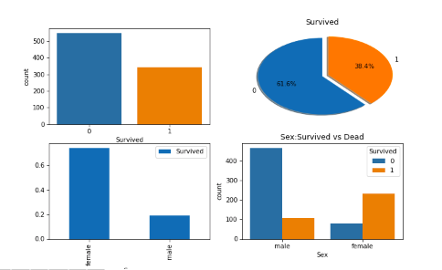
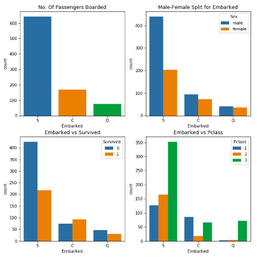
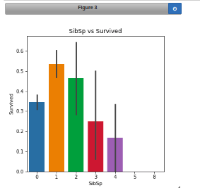
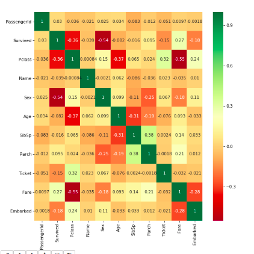
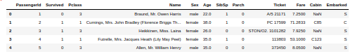

# Day2

### Problem Statement

Titanic dataset cleaning+Feature Engineering and visualization only (Apply what you learned in Day1) 

### Requirements

`pip install seaborn`

`pip install sklearn`

### Dataset

The dataset used in the problem can be found here:

[Titanic Dataset](input/train.csv)

### Outputs

#### Survival vs Gender Plot

#### Embarked vs Survived

#### SibSp vs Survived Plot

#### Correlation Matrix

#### Uncleaned Dataset

#### Cleaned Dataset

