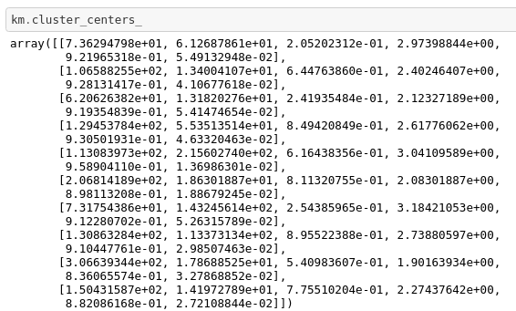

# Day4

## Problem Statement

Develop a model over Expedia Dataset

## Requirement

`pip install numpy`

`pip install seaborn`

`pip install sklearn`

`pip install matplotlib`

## Dataset

[Personalize Expedia Hotel Searches]( https://www.kaggle.com/c/expedia-personalized-sort/data)

## Approach

* Load the Dataset
* Find NaNs in the data and remove columns having them
* Dataset is very huge, hence we will work on a subset
* Find the most populat property, country and room
* Perform a K Means Clustering
* Plot out Graphs

## Results & Outputs

Formed 10 Clusters

**Cluster Centers**

**Elbow Curve**

**5D K Means Graphs**

x = price_usd
y = srch_booking_window
z = srch_saturday_night_bool
c = Cluster labels
s = varied sizes based on srch_length_of_stay

