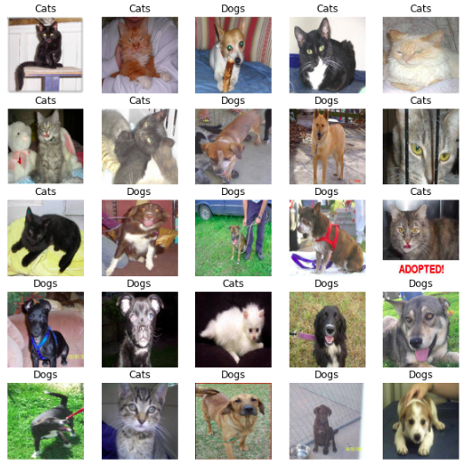
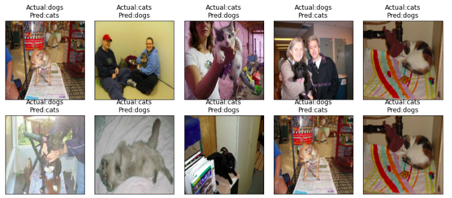
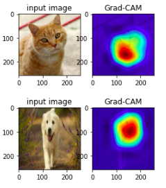
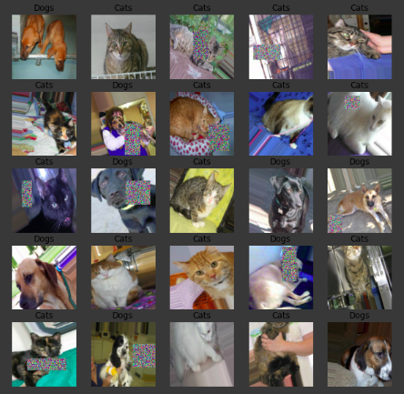
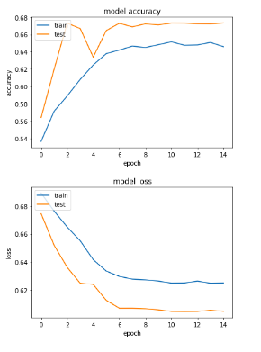

# Day5

## Problem Statement

To classify dogs and cats.

## Requirements

`pip install tensorflow`

`pip install matplitlib`

`pip install scipy`

`pip numpy`

## Approach

### Using Transfer Learning

* Model Used is Resnet 50 Model trained over imagenet Dataset
* Froze the complete model except the last two layer
* created an image gallery for Misclassified Images
* Used Attension maps to identity firing neurons.

### Using Custom Model

* Lad Dataset
* Develop the Model
* Develop Cutout Augmentation Technique
* Train the model with an LR Scheduler

## Dataset

The Dataset can be found here : [Link](https://storage.googleapis.com/mledu-datasets/cats_and_dogs_filtered.zip)

Testing Images can be found [here](Assets/)

## Results

### Transfer Learning:

* Model Parameters: 23,568,485
* Train Accuracy:98.09%
* Test Accuracy: 99.20%

### Custom Model:

* Model Parameters: 306,881
* Train Accuracy: 65.16%
* Test Accuracy: 67.34%

## Output Visualization

### Using Transfer Learning

**Input Data:**

**Misclassified Images:**

**GradCAM Output:**

### Using Custom Models

**Cutouts Added to Dataset**

**Accuracy-Loss Curve**

