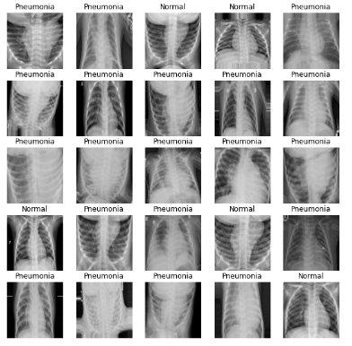
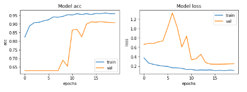
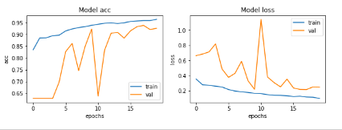

# Day 6 - Task B

## Problem Statement

Image Classification for Pneumonia X Ray Images

## Requirements

`pip install tensorflow`

`pip install matplotlib`

`pip install numpy`

`pip install sklearn`

## Dataset

The dataset can be found under [here](https://www.kaggle.com/paultimothymooney/chest-xray-pneumonia).

## Approach

* Loaded the Dataset.
* Developed a DNN with Seperable Conv2D layers, BatchNorm(Faster Convergence) and Dropouts(Regularization Technique).
* Reduce LR as an LR Scheduler and Trained the Model.
* Developed Cycle LR as an LR Scheduler and Trained the Model.
* Visualized the Accuracy- Loss Curve and Check for F1 Score.

## Results

1. Reduced LR

* Model Parameters: 384,257
* Train Accuracy: 96.35%
* Test Acccuracy: 91.32%
* Precision: 100%
* Recall: 76.0%
* F1 Score = 86.36

2. OneCycle LR
* Model Parameters: 384,257
* Train Accuracy: 96.33%
* Test Acccuracy: 93.75%
* Precision: 100%
* Recall: 71.42%
* F1 Score = 83.33

## Output

**Dataset Gallery**

**Train - Test Curve Reduced LR**

**Train - Test Curve Onecycle LR**

