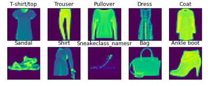
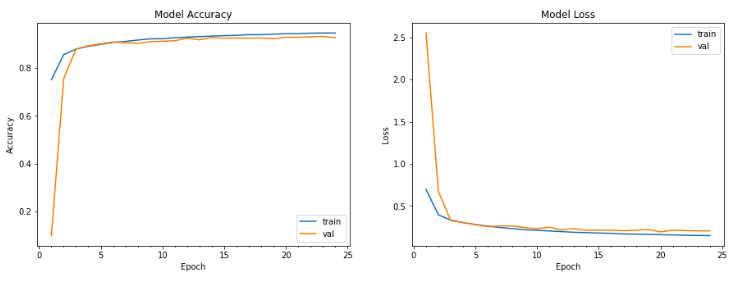
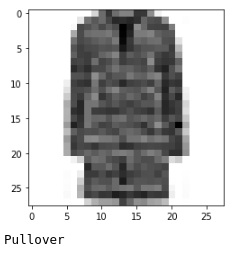
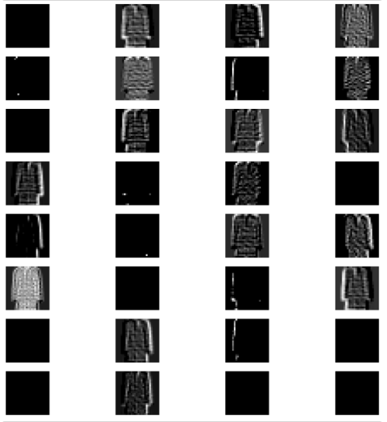

# Day 6 - Task B

## Problem Statement

Image Classification for Fashion MNIST Dataset

## Requirements

`pip install tensorflow`

`pip install matplotlib`

`pip install numpy`

## Dataset

The dataset can be found under [Tensorflow Dataset](https://www.tensorflow.org/datasets/catalog/fashion_mnist).

## Approach

* Loaded the Dataset.
* Developed a DNN with BatchNorm(Faster Convergence) and Dropouts(Regularization Technique).
* Used One Cycle LR as an LR Scheduler and Trained the Model.
* Visualized the Kernels.

## Results

* Model Parameters: 791,428
* Train Accuracy: 94.55%
* Test Acccuracy: 93.12%

## Output

**Dataset Gallery**

**Train - Test Curve**

**Input Image for Kernel Visualization**

**Kernel Visualization**
Plotting the output of the first kernel

