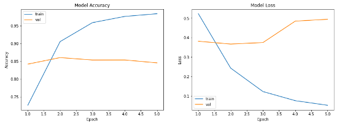

# Day7 - TaskA

## Problem Statement

Sentimental Analysis over IMDB Dataset

## Requirements

`pip installl tensorflow`

`pip install matplotlib`

`pip install numpy`

## Dataset

The dataset can be found over [tensorflow site](https://www.tensorflow.org/api_docs/python/tf/keras/datasets/imdb).

## Approach

* Load Data
* Create and Embedding layer
* Load A GRU Layer
* Train the Model
* Calculate Accuracy

## Results And Outputs

**Model Parameters:** 40,090,701

**Train Accuracy:** 98.37%

**Test Accuracy:** 86.07%

**Accuracy-Loss Curve**

