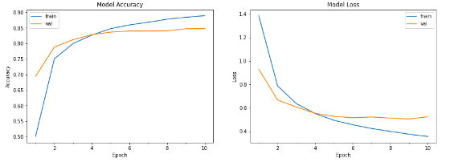

# Day8 - TaskA

## Problem Statement

Implementing Multiclass Classification over US Consumer Finance Complaints.

## Requirements

`pip installl tensorflow`

`pip install matplotlib`

`pip install numpy`

`pip install pandas`

`pip install sklearn`

## Dataset

The dataset can be found over [here](https://www.kaggle.com/subhassing/exploring-consumer-complaint-data/data)

## Approach

* Load Data and preprocess it(Keep Only text column and its corresponding data)
* Split the data.
* Create an Embedding layer
* create a network using Conv1D layer and Bidirectional LSTM Layer.
* Train the Model over TPU
* Calculate Accuracy

## Results And Outputs

* Model Parameters: 1,220,833

* Train Accuracy: 88.92%

* Test Accuracy:84.76%

**Accuracy-Loss Curve**

