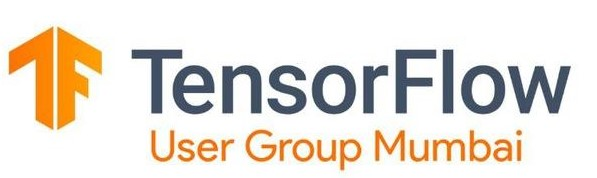

<h1 align="center">10 Days of ML Challenge</h1>
<h2 align="center">by TensorFlow Usergroup Mumbai</h2>

This contains the solution for questions I solved which were posted in this challenge. It was a 10 Day event, everyday new problems were hosted targetting a new concept and segment of Machine Learning. We were asked to solve any one of those problems. This readme lists contains all the problems which were hosted, each heading will direct you to its individual page which will list the problem and its solution.

---

## [Day 1](Day1/)

> ### Problem Statement
>> On a particular date, If 70% number of confirmed case is zero, then Delete the column. i.e. whole February will be deleted and few more. Plot the graph
>>> * Country Wise
>>> * Date Wise
>>> * Continent Wise

## [Day2](Day2/)

### Problem Statement

Titanic dataset cleaning+Feature Engineering and visualization only (Apply what you learned in Day1) 

## [Day3](Day3/)

### Problem Statement

**Task A:**

1. Predict Loan Status
2. Predict Rating

**Task B(Solved):**

Analyze Toxicity of Comments.

## [Day4](Day4/)

### Problem Statement

Develop a model over Expedia Dataset

## [Day5](Day5/)

### Problem Statement

To classify Dogs and Cats

## [Day6](Day6/)

### Problem Statement

**Task A:**

Image Classification for Fashion MNIST Dataset

**Task B:**

Image Classification for Pneumonia X Ray Images

## [Day7](Day7/)

### Problem Statement

**Task A(Solved):**

Sentimental Analysis over IMDB Dataset

**Task B:**

Sentimental Analysis over Twitter Dataset

## [Day8](Day8/)

### Problem Statement

**Task A:** 

Document Clustering

**Task B(Solved):**

MultiClass Classification

## [Day 9 & 10](Day9&10/)

### Problem Statement

Develop a project using Tensorflow JS.

---

<h3 align="center">Made with 💘 by Killerstrike</h3>